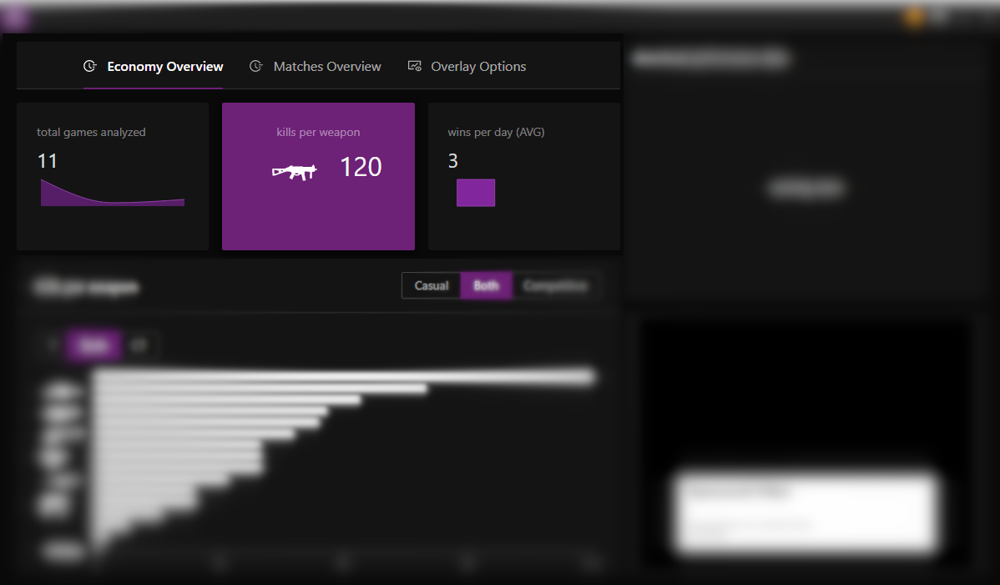
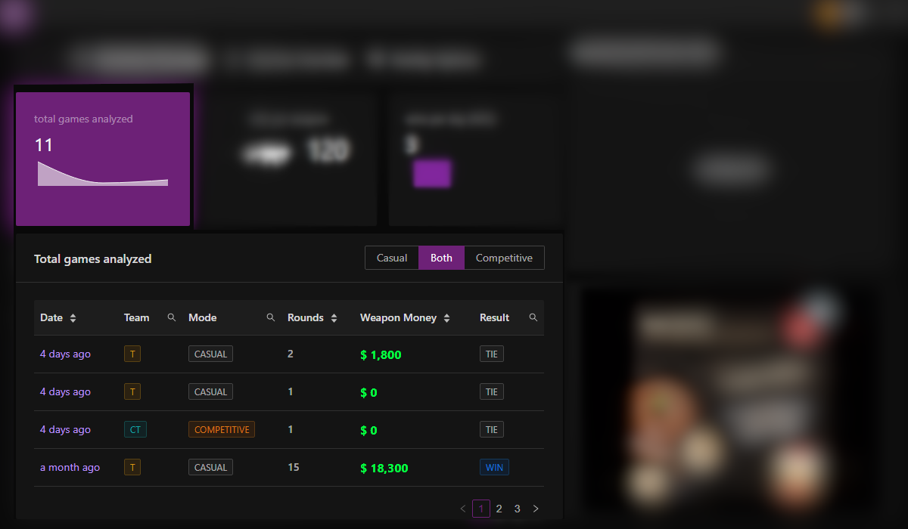
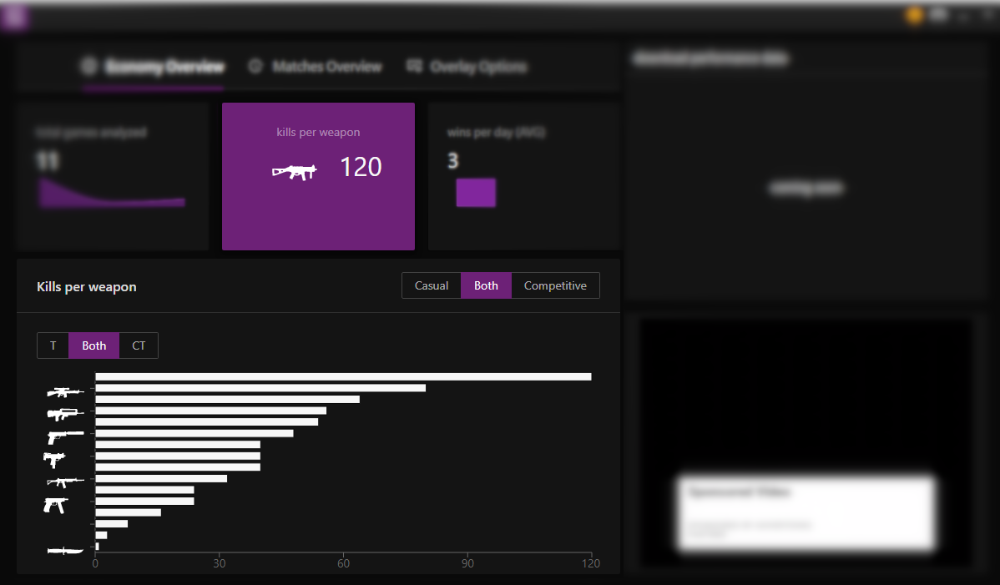
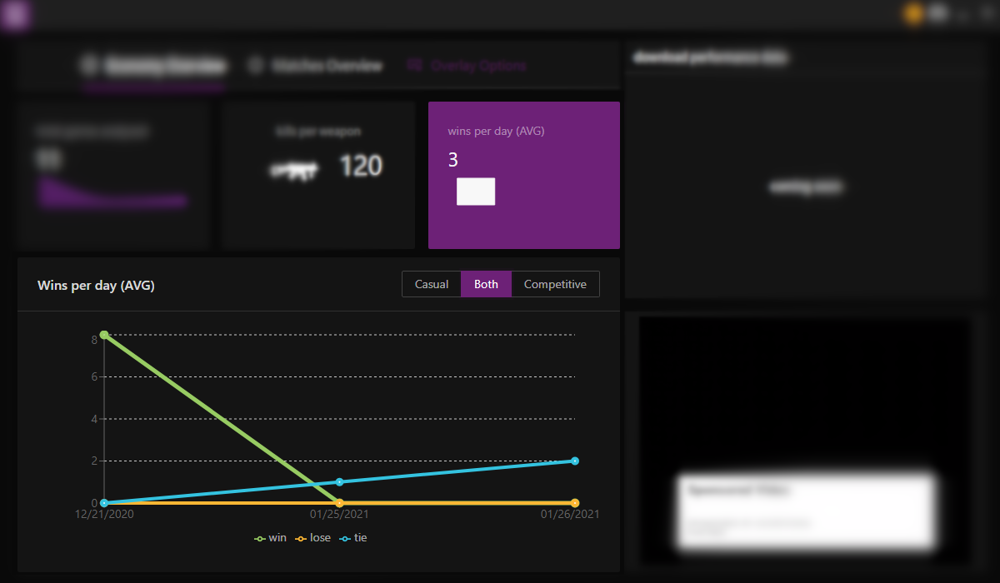

This tab provides an overview of the player's performance in using the money. it's an excellent way to understand the points to improve the macroeconomics in a detailed aspect.

<!--truncate-->

## Top Cards

---

All top cards are clickable and each click displays more details about the data.

---

### Total Games Analyzed

The number displayed and mini line graph represents the total of games analyzed.

#### Total Games Analyzed Tab

When Total Games Analyzed has clicked, displayed a table of each games has analyzed.

---

### Kills Per Weapon

The number displayed represents the total of kills per weapon in all matches.

#### Kills Per Weapon Tab

When Kills Per Weapon has clicked, displayed a graph of each weapons performance.

---

### Wins Per Day

The number displayed and mini line graph represents the total of wins per day.

#### Wins Per Day Tab

When Wins Per Day has clicked, displayed a graph of matches results.

---
