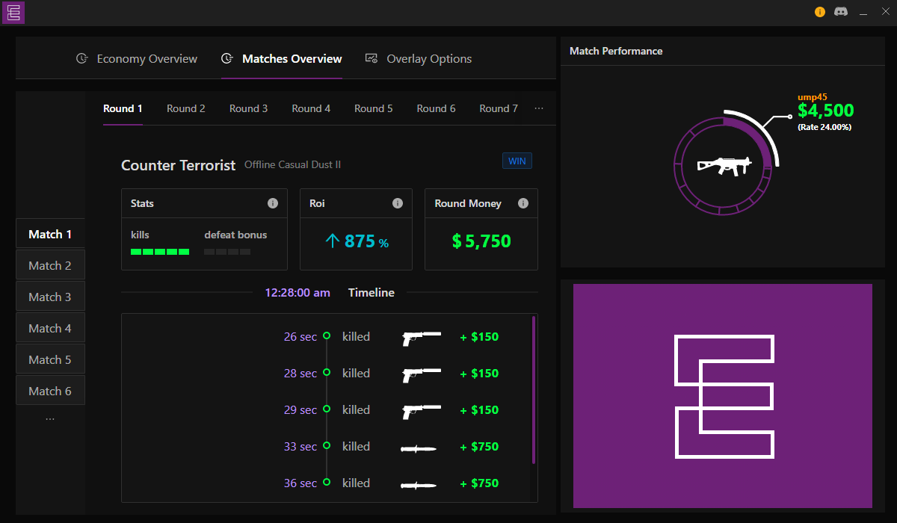
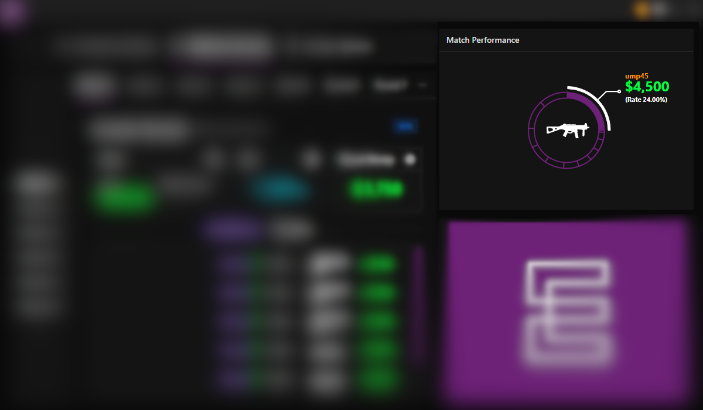
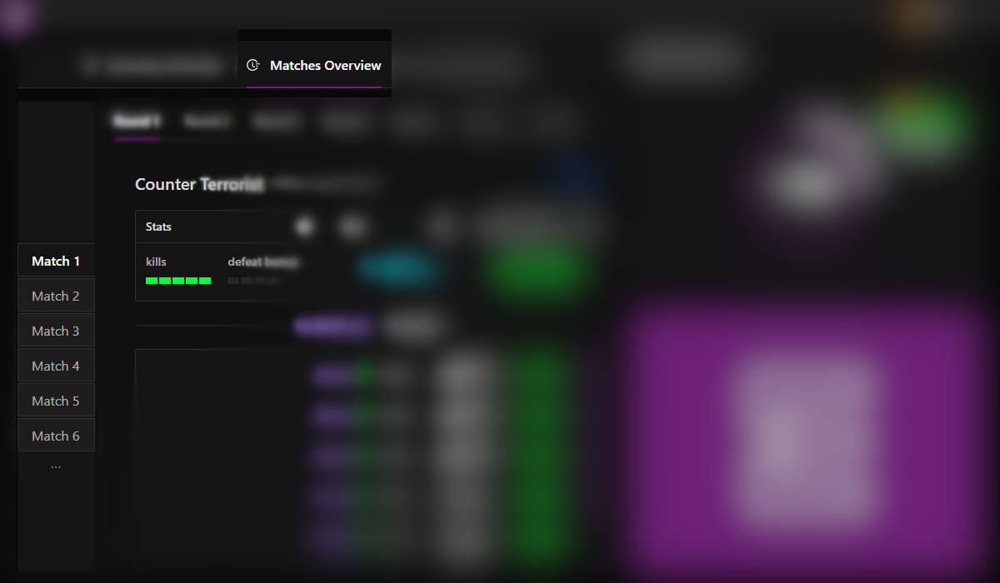
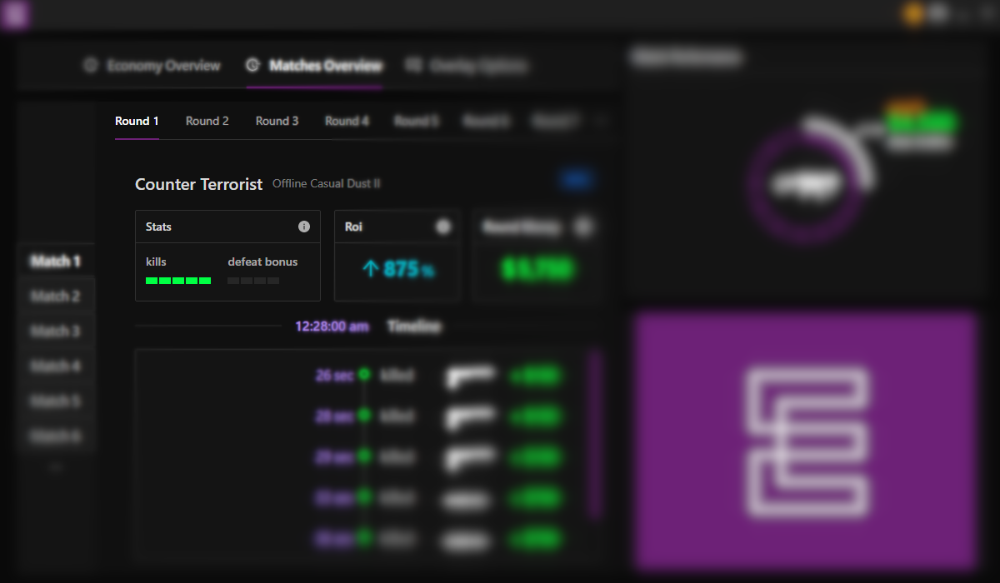
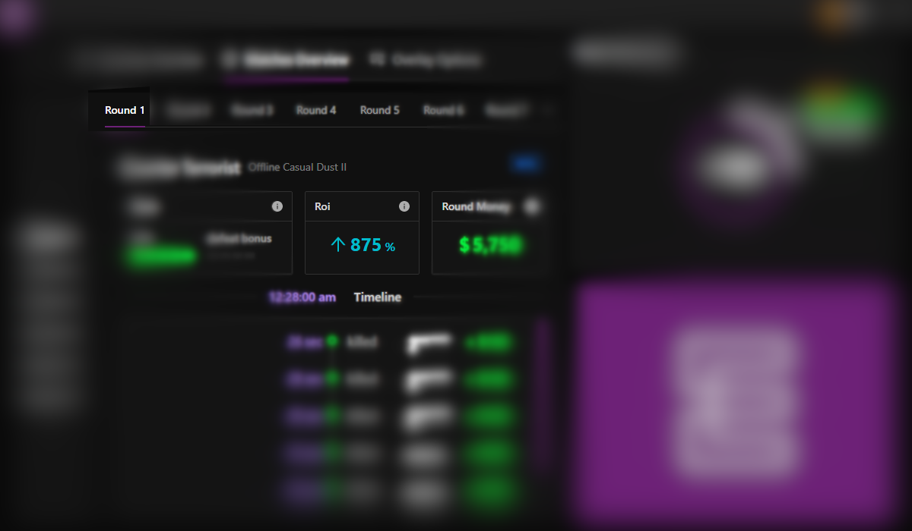
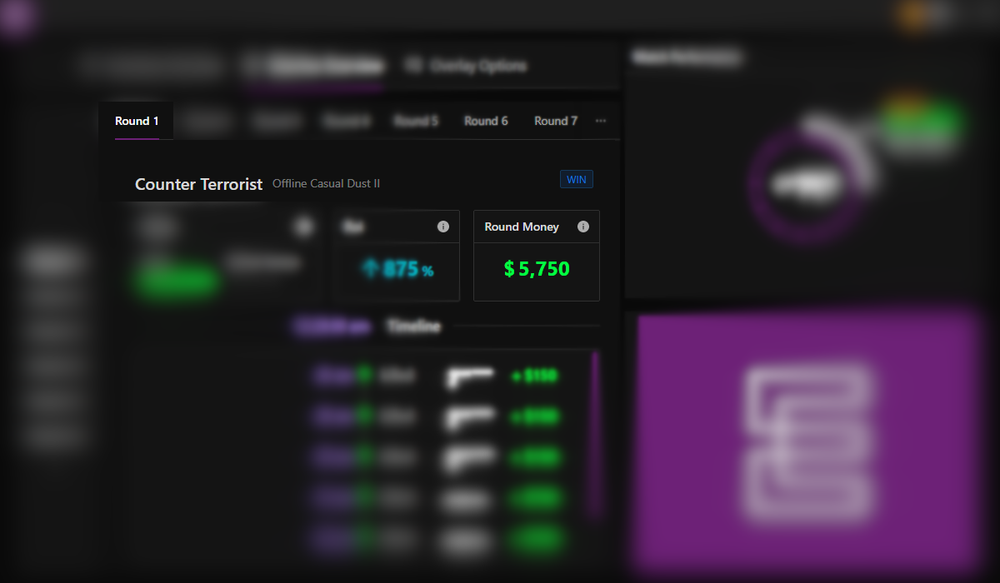

This tab provides an overview of the player's performance in using the money. it's an excellent way to understand the points to improve the macroeconomics in a detailed aspect.

<!--truncate-->

---

## Match Performance

Displays a graph of weapons that represents the sum of money earned per match.

---

## Left Menu - Matches

When a menu item is clicked, all the economy information of the match is displayed.

---

## Top Menu - Rounds

When a round menu item is clicked, all the economy information of the round is displayed.

> cards have detail icons in the upper right corner.

### Stats

Displays the total number of kills and the value of the defeat bonus.

### ROI

Return on investment (ROI) or return on costs (ROC) is a ratio between net income (over a period) and investment (costs resulting from an investment of some resources at a point in time).

### Round Money

Total money earned.

### Timeline

Displays a detailed timeline.

---
