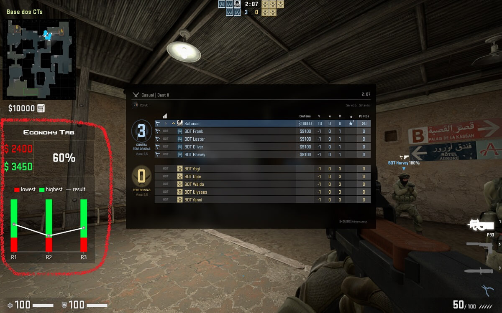

The Economy Tab is displayed within the game when a hotkey is pressed.

> the default hotkey is **TAB**, this key can be changed in options.

### Prediction Highest Money

The prediction highest money is represented by the green color, both in graphical and numerical value.

### Prediction Lowest Money

The prediction lowest money is represented by the red color, both in graphical and numerical value.

### Current Money

The current money is represented by the grey color, both in graphical and numerical value.

---
